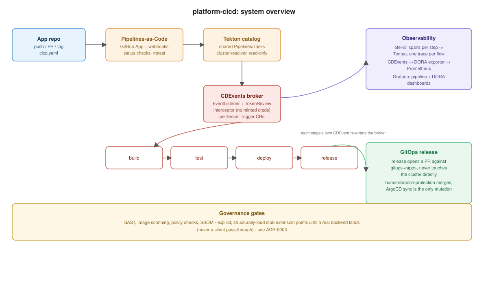

# platform-cicd

A CI/CD platform for Kubernetes, built on Tekton + Pipelines-as-Code. Installable
standalone on any cluster, or as the CI/CD component of a larger internal developer
platform.

**Platform-as-a-service model**: application developers write one file,
[`cicd.yaml`](docs/user/cicd-yaml-reference.md), at their repo root. They never see,
write, or edit Tekton YAML. Everything else - triggering, chaining, tracing,
dashboards, governance, release promotion - is the platform's job.

- **New to the platform as a developer?** Start at [docs/user/](docs/user/).
- **Installing or operating the platform?** Start at [docs/admin/](docs/admin/).

## Architecture, in one page



Two distinct triggering mechanisms, because they have genuinely different trust models:

- **Git-sourced events** (push, PR, tag, release, PR-comment ChatOps) are owned entirely
  by **Pipelines-as-Code**. Its GitHub App handles webhook auth and PR status checks
  natively. Each app repo needs a small, platform-generated `.tekton/*.yaml`
  boilerplate file - developers never hand-write it. See
  [docs/admin/onboarding-mechanics.md](docs/admin/onboarding-mechanics.md).
- **Inter-stage chaining** (build finished → start test; test passed → start deploy)
  isn't a git event, so PaC doesn't cover it. A shared internal broker
  ([`platform/broker/`](platform/broker/)) relays CDEvents between independently-
  triggered PipelineRuns, authenticated via each pod's own Kubernetes-issued
  ServiceAccount token (TokenReview) instead of a platform-minted credential. See
  [docs/admin/chaining.md](docs/admin/chaining.md).

Every pipeline step emits an OpenTelemetry span (via `otel-cli`, wrapped in
[`catalog/lib/otel.sh`](catalog/lib/otel.sh)), stitched into **one Tempo trace per
end-to-end flow** even though each stage is a separate PipelineRun - see
[docs/admin/tracing.md](docs/admin/tracing.md). Grafana dashboards give a live +
historical pipeline list, a per-stage drill-down, and DORA metrics.

Governance gates (SAST, image scanning, policy checks, SBOM) are real, enforcing
checks, built as explicit extension points that are never reported with more
confidence than they've earned - see [docs/admin/governance-stubs.md](docs/admin/governance-stubs.md).

`release` never touches a target cluster directly - it opens a PR against a
dedicated `gitops-<app>` repo, gated by governance checks and human review; ArgoCD's
own sync is the only thing that ever mutates the cluster. See
[docs/admin/release.md](docs/admin/release.md).

For the reasoning behind each of these decisions, see the
[Architecture Decision Records](docs/admin/adr/). For the security model end to end -
RBAC, supply chain signing, secrets, multi-cluster trust boundaries - see
[docs/admin/security.md](docs/admin/security.md).

## Repo layout

```
catalog/          shared Tekton catalog - Pipelines, Tasks, StepActions, bash lib, toolbox image
platform/broker/   the internal CDEvents relay: EventListener + TokenReview interceptor (Go)
observability/     kind-observe-specific patches (ServiceMonitor, OTel Collector values)
schemas/           cicd.schema.json - the developer-facing config contract
charts/            platform-cicd-control-plane, platform-cicd-catalog, platform-cicd-app
hack/              cluster bootstrap - see docs/admin/installation.md
docs/user/         application-developer docs - start here if you're onboarding an app
docs/admin/        operator docs - architecture, installation, ADRs
```

## Getting started

```
./hack/bootstrap.sh
# then onboard a pilot repo - see docs/user/install-guide.md
```

See [docs/admin/installation.md](docs/admin/installation.md) for the declarative
(ArgoCD-managed) install path, which is what any new cluster should use going forward.

## Integrating with a larger platform

Every chart here is a standard Helm chart consuming plain values - nothing about this
repo assumes it's the only thing on a cluster. It integrates cleanly as one component
of a broader internal developer platform (e.g. alongside a Crossplane-based service
catalog and self-service app onboarding) without modification: per-cluster state
(trust roots, tenant lists) always lives in that cluster's own config, never inside
this repo - see [ADR-0006](docs/admin/adr/0006-cluster-agnostic-bootstrap.md).
