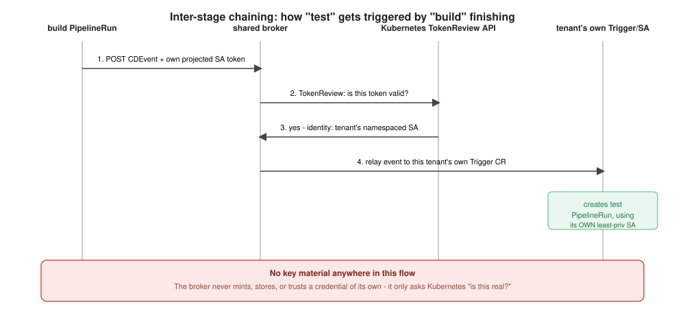
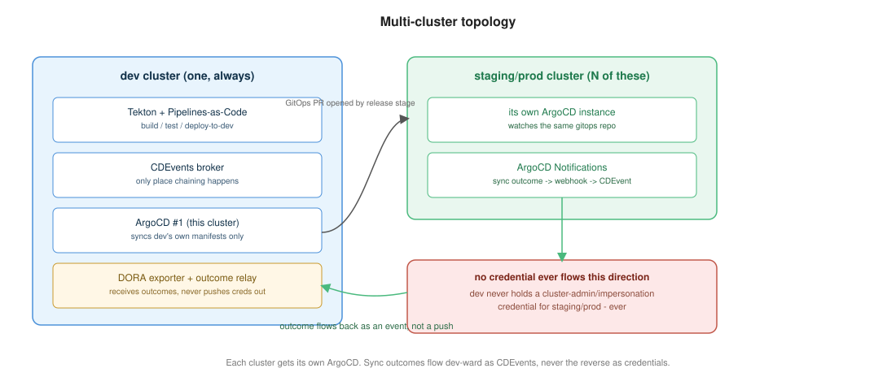

# Architecture

A current-state overview for people running the platform, not writing pipelines
against it. For any specific decision's rationale, see [adr/](adr/).

## Two triggering mechanisms, one deliberate split

**Git-sourced events** (push, PR, tag, release, PR-comment ChatOps) are owned entirely
by Pipelines-as-Code. Its GitHub App handles webhook auth and PR status checks
natively. Each app repo needs a small, platform-generated `.tekton/*.yaml` boilerplate
file - never hand-written.

**Inter-stage chaining** (build finished → start test; test passed → start deploy)
isn't a git event, so PaC doesn't cover it. A shared internal broker
(`platform/broker/`) relays CDEvents between independently-triggered PipelineRuns,
authenticated via each pod's own Kubernetes-issued ServiceAccount token (TokenReview)
rather than a platform-minted credential - see [chaining.md](chaining.md) and
ADR-0002.

## Tracing

Every pipeline step emits an OpenTelemetry span (`otel-cli`, wrapped in
`catalog/lib/otel.sh`), stitched into one Tempo trace per end-to-end flow even though
each stage is a separate PipelineRun. A W3C `traceparent` is established once per flow
and threaded through CDEvent payloads to every subsequent stage. See
[tracing.md](tracing.md).

## Governance

SAST, image scanning, policy checks, and SBOM attestation are real, enforcing gates
today - not placeholders. Each reports as an independent, required GitHub status check
on a release PR. See [governance-stubs.md](governance-stubs.md) and ADR-0003 for why
these are built as explicit, structurally-loud extension points rather than a single
opaque "governance passed" bit.

## Release: GitOps-only

`release` never touches a target cluster directly. It opens a PR against a dedicated
`gitops-<app>` repo; a human/branch-protection rule merges it; ArgoCD's own sync is the
only thing that ever mutates the cluster. See [release.md](release.md) and ADR-0004.

## Multi-cluster

Only the dev cluster runs Tekton/PaC/the broker. Staging/prod clusters each get their
own ArgoCD instance watching the same gitops repo - never a shared/remote-cluster
credential from dev. Sync outcomes flow back to dev as CDEvents (via ArgoCD
Notifications → a webhook → a relay service), not as a push in the other direction.
See [multi-cluster.md](multi-cluster.md) and ADR-0005.

## Cluster-agnostic bootstrap

Every cluster installs the same way: a declarative ArgoCD `Application`, consuming a
per-cluster values file produced by `hack/generate-cluster-values.sh`, never
hand-typed. Cluster-specific state (Fulcio trust root, cluster CA) lives in that
cluster's own `gitops-cluster-<name>` repo, never inside `platform-cicd` itself. See
[installation.md](installation.md) and ADR-0006.

## Security model

No cluster-admin, no broad SA impersonation, anywhere - every tenant gets
namespace-scoped RBAC only, and the shared broker authenticates callers via
TokenReview instead of trusting a bearer token it minted itself. See
[security.md](security.md) for the full model end to end (RBAC, supply chain,
secrets, multi-cluster boundaries, and known/accepted gaps) - this page only
covers the piece directly relevant to chaining.
