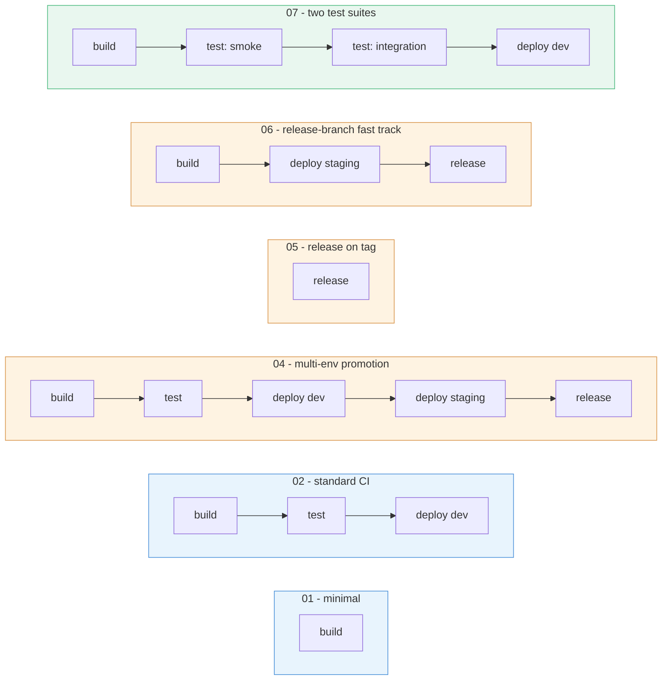

# Pipeline examples

Ten complete, schema-valid `cicd.yaml` files, each fully commented, covering the shapes
you're most likely to actually want. Copy whichever is closest to your needs and adjust.

Every file here is validated against `schemas/cicd.schema.json` and rendered through the
real Helm chart as part of this repo's own checks - if it's in this folder, it works.

| # | File | Shape |
|---|---|---|
| 1 | [01-minimal-build-only.yaml](01-minimal-build-only.yaml) | `build` only - the smallest valid config |
| 2 | [02-standard-ci.yaml](02-standard-ci.yaml) | `build` → `test` → `deploy(dev)` - the common case |
| 3 | [03-pr-validation.yaml](03-pr-validation.yaml) | PR builds, separate from the main push flow |
| 4 | [04-multi-env-promotion.yaml](04-multi-env-promotion.yaml) | dev → staging → governed `release` |
| 5 | [05-release-on-tag.yaml](05-release-on-tag.yaml) | Git-rooted release, triggered by a version tag |
| 6 | [06-release-branch-fast-track.yaml](06-release-branch-fast-track.yaml) | A `release/*` branch skips dev entirely |
| 7 | [07-multi-suite-testing.yaml](07-multi-suite-testing.yaml) | Two test suites against one build |
| 8 | [08-dockerfile-only-build.yaml](08-dockerfile-only-build.yaml) | Whole build inside a multi-stage Dockerfile |
| 9 | [09-ephemeral-environments.yaml](09-ephemeral-environments.yaml) | A live preview environment per PR/branch |
| 10 | [10-production-grade.yaml](10-production-grade.yaml) | Everything together - path filters, caching, governance, notifications |

## Quick visual index

*(03, 08, 09, 10 aren't shown above since they're variations of build strategy /
platform features rather than a different flow shape - see the table.)*

## Picking one

- **Just getting started?** → 01, then 02.
- **Want PRs validated before merge, without deploying them?** → 03.
- **Need a real promotion path with human review before production?** → 04.
- **Cut release branches/tags deliberately rather than auto-promoting every commit?**
  → 05 or 06.
- **Have more than one kind of test to run?** → 07.
- **Build entirely inside Docker, no separate build script?** → 08.
- **Want reviewers to see a live version of a PR before merging?** → 09.
- **Want to see a realistic "everything a real service needs" config?** → 10.

See [../quickstart.md](../quickstart.md) for how to go from any of these to a running
pipeline, and [../cicd-yaml-reference.md](../cicd-yaml-reference.md) for what every
field means.
