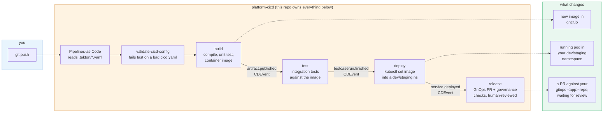

# platform-cicd: user guide

This is the documentation for **application developers** using this platform - not the
people building or operating the platform itself. If you're onboarding a new app or
maintaining an already-onboarded one, start here.

The one-sentence version: you write a single `cicd.yaml` at your repo root, you push,
and the platform builds/tests/deploys/releases your app. You never write Tekton YAML,
never touch `.tekton/`, and never configure a CI server by hand.

## Where to go

| Doc | Read this when... |
|---|---|
| [quickstart.md](quickstart.md) | You want your first pipeline running in the next five minutes. |
| [cicd-yaml-reference.md](cicd-yaml-reference.md) | You need to know exactly what a field does - the comprehensive, fully-annotated reference. |
| [features.md](features.md) | You want the tour: what this platform actually does for you, beyond "runs my build." |
| [examples/](examples/) | You know the shape of pipeline you want and just need a template to copy. |

If you're setting up a **brand new app** on the platform for the first time (not just
editing `cicd.yaml` on an already-onboarded one), you also need
[../onboarding.md](../onboarding.md) - that covers the one-time, platform-side setup
(repo creation, GitHub App installation, chart install) that happens before `cicd.yaml`
means anything.

## The big picture

Every stage below is a real Tekton Pipeline running in the platform's cluster - you
never see any of this directly, but it helps to know the shape of it when you're
reading error messages or wondering why something didn't fire.

Two things worth internalizing from this picture before you read anything else:

1. **Only the first stage of a flow is triggered by your git push directly.** Every
   stage after that is triggered by the *previous stage's own completion event* - not
   by anything happening in GitHub. This is why the platform can chain
   build→test→deploy→release without you writing any orchestration - see
   [cicd-yaml-reference.md](cicd-yaml-reference.md#how-flows-work) for the mechanics.
2. **`release` never touches your running app directly.** It opens a pull request
   against a separate `gitops-<app-name>` repo and stops there - a human (or your
   branch protection rules) decides when that PR merges, and ArgoCD's own sync is the
   only thing that ever actually touches the target cluster. See
   [features.md](features.md#release-promotion) for why.
