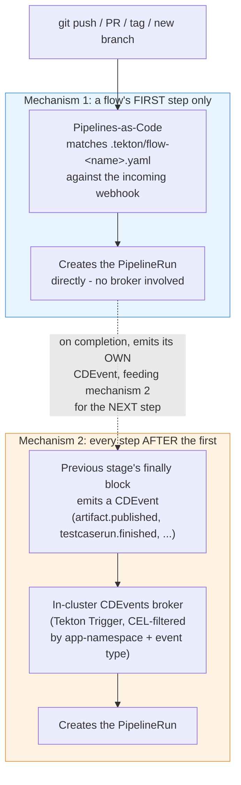
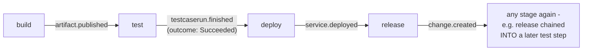

# `cicd.yaml` reference

`cicd.yaml` at an app repo's root is the **only** file a developer edits to control
their pipelines. There is no Tekton YAML to write, read, or understand - the platform
owns everything under `.tekton/` (pure boilerplate, generated at onboarding, see
[../onboarding.md](../onboarding.md)) and the shared catalog (`catalog/`).

This doc covers every field. If you just want a working file fast, see
[quickstart.md](quickstart.md) or copy one of [examples/](examples/) instead.

## Everything, annotated

Every field this schema accepts, in one place, with an inline comment explaining what
it does, its default, and whether it's actually load-bearing yet. Nothing here is
required except what's marked `REQUIRED` - most apps use a small fraction of this file.

```yaml
# --- Identity - both required, both fixed values today ---
apiVersion: platform/v1        # REQUIRED. Only one valid value.
kind: PipelineConfig           # REQUIRED. Only one valid value.

# --- build: REQUIRED block. Only `agent` inside it is required. ---
build:
  agent: nodejs-20              # REQUIRED. One of: nodejs-18, nodejs-20, nodejs-22,
                                 # openjdk-17, openjdk-21, python-3.11, go-1.22.
                                 # A named platform-catalog image, not a raw image
                                 # reference - keeps the step portable and centrally
                                 # patchable. Used for unit tests regardless of which
                                 # build strategy (below) you pick.
  script: ./build.sh            # Optional. Omit entirely to build your whole app
                                 # inside a multi-stage Dockerfile instead (kaniko
                                 # builds `dockerfile` directly, build-source is
                                 # skipped). Presence/absence is the switch - there's
                                 # no separate boolean, so a typo can't silently
                                 # disable it. Must be bash.
  dockerfile: ./Dockerfile      # Optional, default "./Dockerfile". Packaging step if
                                 # `script` is set; the whole build if it's not.
  unitTest:
    enabled: true                # Optional, default true. false skips the unit-test
                                  # command but the stage still runs (span, notify).
    command: ./test.sh           # Optional, default "./test.sh".
  sonar: false                   # Optional, default false. Reserved field - see
                                  # features.md for current status.
  cache:
    enabled: false                # Optional, default false. Only applies to the
                                   # `script` build path - the Dockerfile-only path
                                   # gets kaniko's own layer cache instead, for free.
    size: small                   # Optional, default "small". One of small (1Gi),
                                   # medium (2.5Gi), large (5Gi), xlarge (8Gi). Not
                                   # resizable after onboarding without losing the
                                   # cached content. No `type` field - derived from
                                   # `agent`'s prefix (nodejs-* -> npm cache,
                                   # openjdk-* -> Maven local repo). A no-op for
                                   # python-*/go-1.22 agents (not supported yet).
  sourceVolume:
    size: small                   # Optional, default "small". One of small (2Gi),
                                   # medium (5Gi), large (10Gi), xlarge (20Gi). Sizes
                                   # the ephemeral `source` workspace every stage's
                                   # PipelineRun gets (checked-out repo + build output +
                                   # kaniko's build context) - bump this if a build fails
                                   # with "no space left on device", NOT build.cache
                                   # (that's a separate, persistent dependency cache).
                                   # One value applies to every stage's source workspace
                                   # for this app, not build-only.

# --- test: optional block. See "The test: block" below for the full story. ---
test:
  enabled: true                 # Optional, default true. false skips the actual
                                 # test command but the stage still runs.
  suite: integration            # The app-wide default suite name every `test` step
                                 # inherits unless it sets its own `suite`. One of
                                 # this or a step's own `suite` MUST resolve to a
                                 # value - checked by validate-cicd-config.

# --- deploy: optional block. See "The deploy: block" below. ---
deploy:
  lowerEnvironments: [dev]       # Optional, default [dev]. Which env namespaces get
                                 # pipeline-runner RBAC provisioned. A deploy step's
                                 # `env` (below, under pipelines:) MUST appear in this
                                 # list or upperEnvironments, or validate-cicd-config
                                 # rejects the flow before anything runs.
  upperEnvironments: []          # Optional, default []. Same mechanism as above; the
                                 # lower/upper split itself has no behavioral
                                 # difference today - reserved for multi-cluster work.
  strategy: deployment            # Optional, default "deployment". "rollout" (Argo
                                 # Rollouts canary/blue-green) is accepted but has
                                 # NO EFFECT YET - every deploy is a plain Deployment
                                 # `set image` regardless of this value.

# --- ephemeralEnvironments: optional block. See features.md for the full writeup. ---
ephemeralEnvironments:
  branch:
    enabled: false                # Optional, default false. Spin up a real,
                                   # temporary deploy per matching branch.
    patterns: ["preview/*"]       # Optional, default ["preview/*"]. Glob(s) a
                                   # branch name must match to get its own env.
  pullRequest:
    enabled: false                # Optional, default false. Same idea, gated on a
                                   # PR label instead of a branch name.
    labels: ["preview"]           # Optional, default ["preview"]. PR must carry one
                                   # of these labels to get an ephemeral env.
  ttl: 5d                        # Optional, default "5d". Pattern: digits + h or d.
                                 # How long an ephemeral env survives after its last
                                 # successful deploy before automatic teardown.

# --- governance: optional block. Real gates, not stubs - see features.md. ---
governance:
  sast: false                    # Optional, default false. Real Semgrep scan.
  imageScan: false               # Optional, default false. Real Trivy scan.
  policyCheck: false             # Optional, default false. Real gitsign commit
                                 # signature verification against
                                 # allowedCommitSigners below.
  sbom: false                    # Optional, default false. Real cosign SBOM
                                 # attestation.
  allowedCommitSigners: []       # Optional, default []. Plain email addresses (not
                                 # regex) - only consulted when policyCheck is true.

# --- notifications: optional block. ---
notifications:
  slack:
    enabled: false                # Optional, default false. Per-stage pass/fail
                                   # notifications to `channel`.
    channel: "#team-deploys"      # Required if slack.enabled is true. No default.
    scanResults: true             # Optional, default true. Separate, shift-left
                                   # notifications the moment a real governance scan
                                   # (sast/imageScan) produces a result, independent
                                   # of the general per-stage notification above. Only
                                   # takes effect when slack.enabled is also true.

# --- secrets: optional. Pulls keys from this app's own backend secret store. ---
# See ../app-secrets.md - open-ended by design, not just for Slack.
secrets:
  - name: slack-webhook-url     # Becomes a key in this app's app-secrets Kubernetes
                                 # Secret. A consuming Task (notify-slack.yaml today)
                                 # mounts app-secrets and reads this exact filename.
  - name: sast-scan-token       # Any future purpose works the same way - no schema or
    key: sast-creds-token       # template change needed, just a new entry here. `key`
                                 # (optional) is the name as it exists in the backend
                                 # store, when different from the name you want here -
                                 # defaults to `name` when omitted, as in the entry above.

# --- pipelines: optional, but the whole point of this file for most apps. ---
# A map of named flows. Each flow has a `trigger` (fires the FIRST step only) and an
# ordered `steps` list (chaining is purely positional - see "How flows work" below).
pipelines:
  <flow-name>:                  # Any name you want - becomes part of generated
                                 # Trigger/PipelineRun object names, so keep it short
                                 # and identifier-safe.
    trigger:
      source: git                # "git" (PaC/webhook-triggered - only valid for a
                                  # flow's FIRST step) or "event" (CDEvents broker -
                                  # not yet supported for a flow's first step, only
                                  # meaningful internally).
      event: push                # One of: push, pull_request, tag, branch.created
                                  # (git sources); deploy/artifact.published/
                                  # testcaserun.finished/service.deployed/
                                  # change.created (internal CDEvents, not for you to
                                  # set directly). No release.created - GitHub sends
                                  # no such webhook PaC can receive; use `tag`
                                  # instead (publishing a Release also creates the
                                  # tag).
      branch: main                # Exact branch name, OR a glob like "release/*".
                                  # Used by push/pull_request (via PaC's own
                                  # on-target-branch matcher) AND by branch.created
                                  # (via a CEL regex the platform builds for you).
      branchPattern: ""           # Accepted by the schema but not currently
                                  # consumed anywhere in the platform - use `branch`
                                  # (it already accepts glob patterns) instead.
      tagPattern: "v[0-9]+\\.[0-9]+\\.[0-9]+"   # REQUIRED when event is "tag". A
                                  # regex (not a glob) the pushed tag name must
                                  # match. Backslash escapes are handled correctly.
      filePathPattern: ["api/**"]  # Optional. Only trigger when a changed file
                                  # matches one of these globs. push events only.
    steps:
      - stage: build              # REQUIRED per step. One of build/test/deploy/
                                   # release. build, if present, must be the flow's
                                   # first step - nothing chains into it.
        env: dev                  # Required for test/deploy/release steps; not
                                   # valid on build. Which environment this step
                                   # targets/exercises.
        suite: integration        # Only meaningful on a test step - see the test:
                                   # block above.
        cluster: prod-cluster     # Only valid on a release step. Accepted, schema-
                                   # validated, but has NO EFFECT YET - reserved for
                                   # multi-cluster work.
        name: my-label            # Optional free-text label, passed through to the
                                   # generated PipelineRun's params. Cosmetic today.
```

## Design rules this file follows

- **Read fresh, every run, from the triggering commit.** `validate-cicd-config` (always
  the first Task in every Pipeline) reads `cicd.yaml` straight out of the cloned
  workspace and validates it on the spot. There is deliberately no ConfigMap sync, no
  cache, no second copy anywhere - a `cicd.yaml` change takes effect on the very next
  push, full stop.
- **Fixed superset DAG, not arbitrary graphs.** `pipelines:` toggles and orders a known,
  finite stage set (`build`, `test`, `deploy`, `release`). It cannot express an
  arbitrary DAG - that would require compiling a bespoke Pipeline per app, a meaningfully
  heavier engineering commitment than is justified until there's real evidence apps need
  it.
- **`governance` toggles are honest about being real, not stubs.** Setting
  `governance.sast: true` runs a real Semgrep scan - see [features.md](features.md) and
  [../governance-stubs.md](../governance-stubs.md) for exactly what each gate verifies.

## Two build strategies: `build.script`, or a multi-stage Dockerfile

`build.script` (e.g. `./build.sh`) is **optional**, not required. Two ways to structure
a build, pick whichever fits:

- **Script + thin Dockerfile** (the common shape - see
  [examples/02-standard-ci.yaml](examples/02-standard-ci.yaml)): `build.script` does the
  actual build (`npm ci && npm run build`, `mvn package`, ...) inside the resolved
  `build.agent` image, and `build.dockerfile` becomes a thin packaging step that just
  copies the already-built artifacts. This runs as its own Tekton Task (`build-source`),
  concurrently with unit tests.
- **Everything in a multi-stage Dockerfile** (see
  [examples/08-dockerfile-only-build.yaml](examples/08-dockerfile-only-build.yaml)):
  omit `build.script` entirely and do the whole build inside `build.dockerfile`
  (`FROM ... AS builder` / `RUN npm ci && npm run build` / `COPY --from=builder`). The
  `build-source` Task is skipped entirely and kaniko builds the Dockerfile directly.
  Build caching in this path comes from kaniko's own layer cache, not `build.cache` -
  order your Dockerfile's `COPY package*.json` / `RUN npm ci` *before* copying the rest
  of the source, or the cache invalidates on every source change regardless of whether
  dependencies changed.

`build.agent` is required either way - unit tests always run inside it, independent of
which build strategy you pick.

## Build dependency caching (`build.cache`)

Only applies to the `build.script` path above - the multi-stage-Dockerfile path caches
via kaniko's own layers instead (see above). Opt in with:

```yaml
build:
  agent: nodejs-20
  script: ./build.sh
  cache:
    enabled: true
    size: small   # small=1Gi, medium=2.5Gi, large=5Gi, xlarge=8Gi - default small
```

No `type` field - it's derived from `build.agent`'s prefix (`nodejs-*` -> npm, `openjdk-*`
-> Maven), not a second, separately-declarable value that could disagree with `agent`.
Agents without cache support yet (`python-*`, `go-1.22`) treat `enabled: true` as a no-op
(logged, not an error).

What's actually cached is the build tool's own *download* cache (npm's tarball cache,
Maven's local repository) - not `node_modules`/`target` directly, since `npm ci` deletes
and rebuilds `node_modules` from scratch by design. The cache is a real, persistent,
**per-app** PVC, keyed by a hash of the relevant lockfile (`package-lock.json`/`pom.xml`)
so a dependency change invalidates it automatically rather than serving stale packages.
Not resizable live after onboarding - changing `size` later means recreating the PVC
(losing its content).

## Build source volume (`build.sourceVolume`)

Every stage's PipelineRun clones the repo into a `source` Tekton workspace - the checked-
out tree, `build.script`'s own output (`dist/`, `target/`, ...), and kaniko's build
context all live there. For most apps the default is plenty; a large monorepo-style repo
or a build that produces a lot of intermediate output can fill it, which shows up as a
build failing with `no space left on device` rather than any error from your own build
script. Bump it with:

```yaml
build:
  agent: nodejs-20
  script: ./build.sh
  sourceVolume:
    size: medium   # small=2Gi, medium=5Gi, large=10Gi, xlarge=20Gi - default small
```

This is a different volume from `build.cache` above - `sourceVolume` is the ephemeral,
per-*run* working directory (a fresh `volumeClaimTemplate`-backed PVC every PipelineRun,
torn down when the run completes), while `build.cache` is the persistent, per-*app*
dependency-download cache that survives across runs. Sizing `sourceVolume` up doesn't
help a slow dependency install; sizing `build.cache` up doesn't help a build running out
of disk. One `sourceVolume.size` applies to every stage's `source` workspace for the app
(build/test/deploy/release), not just build's - simpler than a per-stage knob, and build
is normally the only stage large enough to need it anyway. Since it's a fresh PVC every
run, there's nothing to migrate: a size change just takes effect on the next PipelineRun.

## The `test:` block

```yaml
test:
  enabled: true       # default true
  suite: integration  # falls back to nothing - see "How flows work" below, one of
                       # test.suite or a step's own `suite` must be set
```

`test.suite` is the app-wide default suite name, inherited by every `test` step in every
flow that doesn't set its own `suite`. `enabled: false` skips the stage's actual test
command (`./integration-test.sh`) but the stage still runs (span, CDEvent, Slack
notification) - it just reports success without having tested anything. Whatever suite
name is in effect, plus the step's `env` and the image reference under test, reach your
own `./integration-test.sh` as `TEST_SUITE`/`TEST_ENV`/`IMAGE_REF` environment
variables.

## The `deploy:` block

```yaml
deploy:
  lowerEnvironments: [dev]      # default
  upperEnvironments: []         # default
  strategy: deployment          # default; "rollout" is reserved for future
                                 # Argo Rollouts support and has NO effect yet -
                                 # every deploy is a plain Deployment `set image`
                                 # regardless of this value today.
```

`lowerEnvironments`/`upperEnvironments` aren't the thing that decides where a flow
deploys - that's each `deploy`/`release` step's own `env:` under `pipelines:` (below).
This list is what actually provisions RBAC for those namespaces (one `Role`/
`RoleBinding` granting `pipeline-runner` access per listed env) - a step's `env` must
appear here or `validate-cicd-config` now rejects it before anything runs, rather than
failing later with a bare `Forbidden` deep inside the deploy Task. The lower/upper split
itself has no behavioral difference today beyond being two lists concatenated together -
it's there for future multi-cluster work, where lower/upper is expected to matter for
which cluster an environment lives on.

## Multi-stage pipeline flows

The `pipelines:` field enables declarative control of multi-stage, self-chaining
pipelines. Rather than configuring individual legacy triggers, teams declare named flows
with a root trigger source and a sequence of stages. Each flow runs the corresponding
catalog Pipeline (`build`, `test`, `deploy`, `release`) - no custom Pipelines or DAG
configuration needed.

**Editing `pipelines:` has two independent effects, not one** - easy to forget:
changing `cicd.yaml`'s `pipelines:` section and pushing it does NOT, by itself, change
which event-chained Triggers exist in the cluster. That only happens via `helm upgrade`
of the app chart picking up the new `cicd.yaml` as its values file - see
[../onboarding.md](../onboarding.md) step 5. The git push side (delivering the updated
git-rooted `.tekton/*.yaml` PipelineRun definitions) is fully automatic; the
cluster-side Trigger/TriggerBinding/TriggerTemplate objects are not - re-run
`helm upgrade` yourself after any `pipelines:` edit that adds, removes, or reorders
event-chained steps, or the new stages simply won't fire (the git-rooted root stage
still will, since that part IS automatic, which is what makes this easy to miss).

### How flows work

**Two entirely different mechanisms fire a flow's steps**, depending on position:



`deliver-onboarding-files.yaml` generates one `.tekton/flow-<name>.yaml` file per flow
for mechanism 1, driven by your `cicd.yaml`'s `pipelines:` section - see
[../onboarding.md](../onboarding.md#keeping-onboarding-boilerplate-in-sync). Mechanism 2
is what `helm upgrade` provisions, per the "two independent effects" warning above.

**Trigger sources**: The root trigger can be `git` (pushed webhook from
Pipelines-as-Code, for build/release/deploy/test stages) or `event` (CDEvent broker, not
currently a supported way to configure a flow's first step - only used internally).
Subsequent stages are always event-chained: each stage's completion emits a CDEvent that
the next stage listens for.

**Event chaining rules** - keyed by whichever stage the step actually follows, not by
the step's own identity, so any of these pairings works in any combination (confirmed
live, including the less obvious `release` → `test` case):



The event a step listens for is determined entirely by **whichever stage the previous
step in your `steps:` list actually is** - not by the new step's own identity. That's
why `release → test` (an unusual-looking order) works exactly the same way as
`build → test`: `flow-triggers.yaml` looks up the event type from the previous step's
stage name, not from a fixed build→test→deploy→release sequence.

- `build` → next: triggered by `artifact.published` (image built and pushed)
- `test` → next: triggered by `testcaserun.finished` with `outcome: Succeeded` (`test`
  is the one stage whose domain event fires unconditionally, pass or fail - every other
  stage's event is already gated at the source, so only this transition needs the
  outcome check)
- `deploy` → next: triggered by `service.deployed`
- `release` → next: triggered by `change.created`

**Tracing across stages**: Each flow gets a `chain-id` and OpenTelemetry `traceparent` at
the root stage, threaded through all subsequent stages via CDEvent payloads. The
flow-root span covers the entire automated pipeline execution (all stages' durations),
not including human review/merge time.

**Chaining order is positional, full stop.** There is no `after:` field - an earlier
draft had one, but nothing ever read it (chaining was always determined by a step's
index in the `steps:` list, looking at whichever stage the previous entry declares), so
it was pure decoration that could silently disagree with what actually ran. It was
removed rather than left in place. Write your steps in the order they execute.

**Every `test` step needs `env` and a resolvable suite name.** `env` says which
environment's build this run is exercising (there's no default - a test result is
meaningless without knowing what it ran against). The suite name can come from either
the step's own `suite`, or the top-level `test.suite` shared by every test step in the
app - one of the two has to resolve, checked by `validate-cicd-config` before anything
runs. The step-level override only matters once a flow has more than one test step (the
two-step case: hitting the same build with two different suites) - otherwise just set
`test.suite` once and every test step inherits it. Both `env` and the resolved suite
name, along with the image reference under test, reach your own `./integration-test.sh`
as `TEST_ENV`, `TEST_SUITE`, and `IMAGE_REF` environment variables.

**A `deploy` step's `env` must be provisioned.** It has to appear in
`deploy.lowerEnvironments` or `deploy.upperEnvironments` (see above) - that's the list
`deploy-rbac.yaml` actually grants `pipeline-runner` access into. Declaring
`env: staging` on a deploy step without also listing `staging` under
`deploy.upperEnvironments` is now rejected at `validate-cicd-config` time, instead of
failing later with a bare `Forbidden` RBAC error deep inside the deploy Task.

### Event-chained flows (downstream chaining)

Stages after the root are always event-chained - they're triggered by CDEvents emitted
by the previous stage, not by new git events. This is automatic: when you declare a
multi-stage `steps:` list, the platform wires up the event triggers for you (after a
`helm upgrade` - see above).

The **only exception** is if you omit a stage from the flow - say, you configure
`build` → `deploy` with no `test` stage. In that case, `deploy` still waits for
`artifact.published` from `build`; the platform doesn't create a path for `build` to
directly trigger `deploy`. If you need to skip stages conditionally, use the app's own
`cicd.yaml` to enable/disable stages, not the pipelines flow structure.

### Migration from legacy list form

Earlier cicd.yaml files used a list form for the `pipelines:` field:

```yaml
# Legacy (still supported) list form
pipelines:
  - task: build
    trigger: push
    branch: main
  - task: test
  - task: deploy
    triggerEnv: dev
```

This is automatically normalized to the new object form internally. The new form is
preferred for clarity, especially when naming flows or using event-based triggers.

### Local validation before pushing

Run `yajsv -s schemas/cicd.schema.json <(yq -o=json . cicd.yaml)` locally (same tool
`validate-cicd-config` uses) to catch schema errors before a push burns a pipeline run
finding them for you.

## Real bugs found in this mechanism, fixed - worth knowing about if something looks wrong

**`enabled: false` silently ineffective (fixed).** `build.unitTest.enabled` and
`test.enabled` both used to be read via `jq -r '.path.enabled // true'` - jq's `//`
operator treats `false` the same as `null`/missing, so an explicit `enabled: false` was
silently overridden back to `"true"`. No Application had ever actually been able to
disable unit tests or the integration-test stage via `cicd.yaml` until this was found
and fixed. Verified live: `unitTest.enabled: false` now genuinely skips the test
command.

**Integration tests never actually ran, for anyone, ever (fixed).** A separate, deeper
bug in the same area: `run-integration-tests.yaml`'s internal result-passing wrote a
value with a trailing newline that a cross-step variable substitution doesn't strip
(`"true\n"` instead of `"true"`), so its own enabled-check always evaluated false
regardless of the real config. Every integration-test run silently reported "disabled...
skipping." Fixed and confirmed live - a real test command now genuinely runs.

**`branch.created`'s `branch` pattern used to be ignored entirely (fixed).** The CEL
filter generated for a `branch.created` trigger never consulted `trigger.branch` at all
- any newly created branch fired the flow, regardless of the pattern you set. Confirmed
live both before (fired on a non-matching branch) and after the fix (correctly filtered:
a matching `preview/x` branch fired it, a non-matching one didn't).

None of the above require anything from you - they're platform-side fixes, documented
here so a `cicd.yaml` that looked like it "should" have worked before now actually does.
