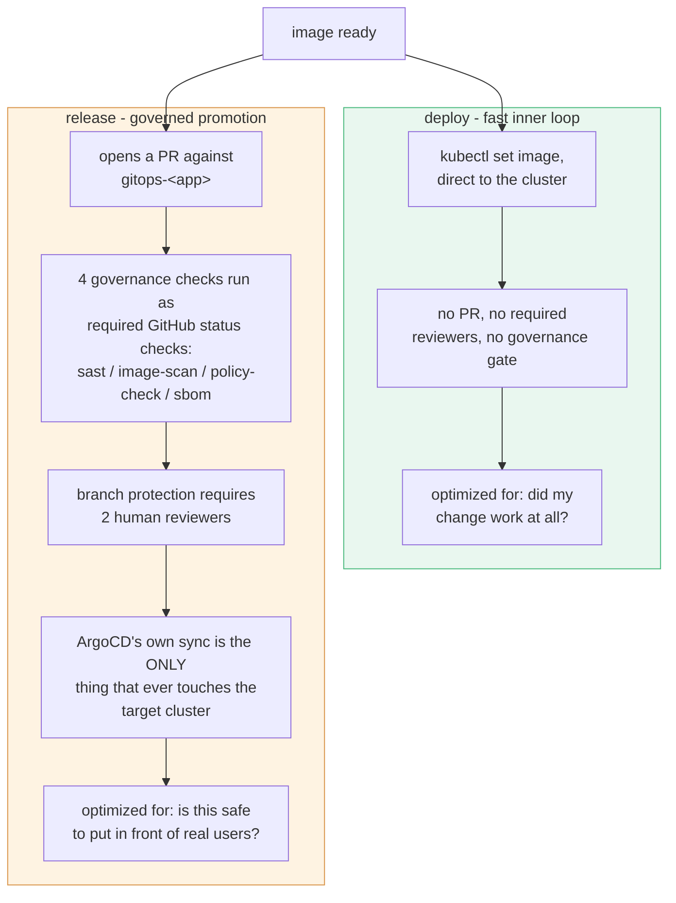

# Features

A capability tour: what this platform actually gives you beyond "runs my build,"
and where to go for the full depth on each. For field-by-field config, see
[cicd-yaml-reference.md](cicd-yaml-reference.md).

## The four stages

Every pipeline is built from up to four stages, each a real Tekton Pipeline in the
shared catalog. You don't write any of them - you declare which ones you want, in what
order, under `pipelines:` in `cicd.yaml`.

| Stage | What it does | Typical trigger |
|---|---|---|
| `build` | Compiles/packages your app, runs unit tests, builds and pushes a container image | `push`, `pull_request`, or `tag` |
| `test` | Runs `./integration-test.sh` against the built image | Chained from `build` |
| `deploy` | `kubectl set image` into a `dev`/`staging`/... namespace - fast, ungated, for inner-loop feedback | Chained from `test` |
| `release` | Opens a PR against your `gitops-<app>` repo, gated by governance checks + human review - never touches the cluster directly | Chained from `deploy`, or git-rooted on a tag |

## Two very different deploy paths, on purpose

`deploy` and `release` look similar (both "ship this image somewhere") but are
deliberately built to completely different standards, because they answer different
questions:



This is why `deploy`'s target environments (`deploy.lowerEnvironments`) and `release`'s
(conceptually "upper" environments, though `env` on a release step has no live effect
yet) are configured separately - see
[cicd-yaml-reference.md](cicd-yaml-reference.md#the-deploy-block). Full detail on the
release mechanics in [../release.md](../release.md).

## Build dependency caching

Persistent, per-app npm/Maven download cache, opt-in via `build.cache.enabled: true`.
Keyed by a hash of your lockfile, so a dependency change gets a fresh cache
automatically instead of serving stale packages. See
[cicd-yaml-reference.md](cicd-yaml-reference.md#build-dependency-caching-buildcache).

## Build source volume sizing

T-shirt-sized `build.sourceVolume.size` (small/medium/large/xlarge) for the ephemeral
per-run `source` workspace - checked-out repo, build output, kaniko's build context.
Bump it if a large build fails with `no space left on device`. See
[cicd-yaml-reference.md](cicd-yaml-reference.md#build-source-volume-buildsourcevolume).

## Governance gates - real, not stubs

`governance.sast`/`imageScan`/`policyCheck`/`sbom` each wire in a genuinely-enforcing
gate, not a placeholder that always passes:

- **`sast`** - real Semgrep scan.
- **`imageScan`** - real Trivy scan.
- **`policyCheck`** - real gitsign commit-signature verification against
  `governance.allowedCommitSigners`. See [../commit-signing.md](../commit-signing.md).
- **`sbom`** - real cosign SBOM attestation.

On a `release`, these four run as independent, individually-required GitHub status
checks against the gitops PR - branch protection won't let the PR merge until all four
pass and the required reviewer count is met. See
[../governance-stubs.md](../governance-stubs.md) for exactly what each one verifies, and
[../image-signing.md](../image-signing.md) / [../provenance-policy.md](../provenance-policy.md)
for the SLSA provenance signing/verification underneath all of this (Tekton Chains +
keyless Fulcio signing + Conforma policy evaluation - genuinely `@slsa3`-passing, not
theatrical).

## Ephemeral environments

Spin up a real, temporary, fully-deployed copy of your app per branch or per PR - useful
for reviewing a change without merging it first.

```yaml
ephemeralEnvironments:
  pullRequest:
    enabled: true
    labels: ["preview"]   # add this label to a PR to get it a live environment
  ttl: 3d                 # torn down automatically 3 days after its last deploy
```

Backed by an ArgoCD ApplicationSet `pullRequest` generator (or a branch-pattern
generator for the `branch:` form) - the environment appears and disappears without you
running anything by hand. See [../ephemeral-environments.md](../ephemeral-environments.md).

## Notifications

```yaml
notifications:
  slack:
    enabled: true
    channel: "#team-deploys"
    scanResults: true   # separate, shift-left pings the moment a scan finishes
```

Real content, not "pipeline finished" noise - build/test/deploy/release status plus
failure log excerpts land directly in your channel. See
[../notifications.md](../notifications.md) and [../design-language.md](../design-language.md)
for the shared visual language across Slack/Grafana/GitHub Checks.

## Full tracing across every stage

Every flow gets a single OpenTelemetry trace spanning every stage it runs through - a
`build` → `test` → `deploy` → `release` chain shows up as one connected trace in Tempo,
not four disconnected ones, even though each stage is a genuinely separate Tekton
PipelineRun potentially minutes apart. CDEvents carry the trace context between stages.
See [../tracing.md](../tracing.md) and [../chaining.md](../chaining.md).

## DORA metrics

Deployment frequency, lead time for changes, change failure rate, and MTTR, computed
from the same CDEvents every pipeline already emits - no separate instrumentation needed
in your app. See [../dora-metrics.md](../dora-metrics.md).

## Stalled-pipeline detection

A background detector that notices when a stage that *should* have started (based on the
previous stage's completion) never did, and alerts - catches the class of bug where an
event silently fails to trigger the next stage, rather than leaving you to notice a
"missing" deploy on your own. See
[../stalled-pipeline-detector.md](../stalled-pipeline-detector.md).

## What's schema-accepted but not live yet

Documented here so you don't spend time debugging a config that can't possibly do
anything - these are accepted by the schema and reserved for known future work, not
typos:

- **`deploy.strategy: rollout`** - Argo Rollouts (canary/blue-green) isn't built yet;
  every deploy is a plain Deployment regardless of this value.
- **`build.sonar`** - reserved, no current effect.

Multi-cluster releases (`deploy.upperEnvironments`' `{name, cluster}` form,
`pipelines.*.steps[].cluster`) are real and live - see
[multi-cluster.md](../multi-cluster.md), not this list.
