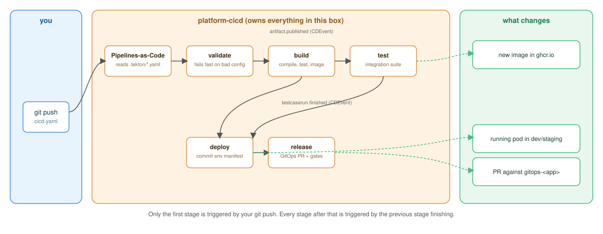

# platform-cicd: user guide

Documentation for **application developers** using this platform - not the people
running it. If you're onboarding a new app or maintaining one already onboarded, start
here.

The one-sentence version: you write a single `cicd.yaml` at your repo root, you push,
and the platform builds/tests/deploys/releases your app. You never write Tekton YAML,
never touch `.tekton/`, and never configure a CI server by hand.

## Contents

| Doc | Read this when... |
|---|---|
| [install-guide.md](install-guide.md) | You're onboarding a **brand-new app** for the first time. |
| [quickstart.md](quickstart.md) | Your app is already onboarded and you want your first pipeline running in the next five minutes. |
| [features.md](features.md) | You want the tour: what the platform does for you, beyond "runs my build." |
| [cicd-yaml-reference.md](cicd-yaml-reference.md) | You need to know exactly what a field does - the comprehensive, in-depth reference. |
| [examples/](examples/) | You know the shape of pipeline you want and just need a template to copy. |

The first four are ordered by depth on purpose: **install-guide** and **quickstart**
are short, step-by-step, and assume nothing. **features** and **cicd-yaml-reference**
are the deep material - read them when you need detail, not before.

## The big picture

Every stage below is a real Tekton Pipeline running in the platform's cluster - you
never see any of this directly, but it helps to know the shape of it when reading
error messages or wondering why something didn't fire.

Two things worth internalizing from this picture before reading anything else:

1. **Only the first stage of a flow is triggered by your git push directly.** Every
   stage after that is triggered by the *previous stage's own completion event* - not
   by anything happening in GitHub. This is why the platform can chain
   build→test→deploy→release without you writing any orchestration - see
   [cicd-yaml-reference.md](cicd-yaml-reference.md#how-flows-work) for the mechanics.
2. **`release` never touches your running app directly.** It opens a pull request
   against a separate `gitops-<app-name>` repo and stops there - a human (or your
   branch protection rules) decides when that PR merges, and ArgoCD's own sync is the
   only thing that ever actually touches the target cluster. See
   [features.md](features.md#release-promotion) for why.
