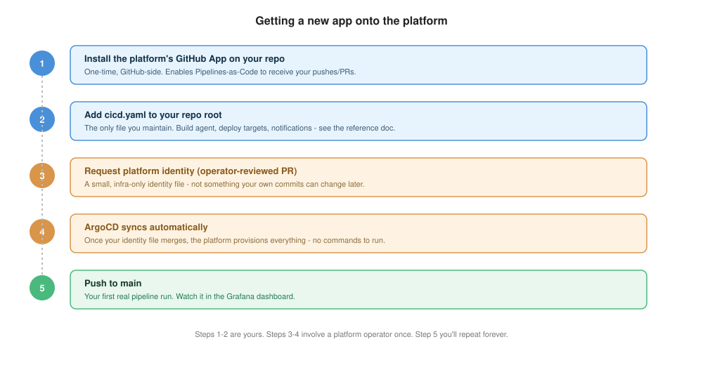

# Install guide: onboarding a new app

This is the one-time setup that happens before `cicd.yaml` means anything. If your app
is already onboarded, skip to [quickstart.md](quickstart.md) instead.



## 1. Install the platform's GitHub App on your repo

One-time, done from GitHub's side. This is what lets Pipelines-as-Code see your pushes
and PRs and report status checks back - no webhook secrets or CI tokens for you to
manage.

## 2. Add `cicd.yaml` to your repo root

This is the only file you maintain going forward. Start from
[quickstart.md](quickstart.md) or copy the closest match from [examples/](examples/).
At minimum you need a `build` block:

```yaml
apiVersion: platform/v1
kind: PipelineConfig

build:
  agent: nodejs-20
  script: ./build.sh

pipelines:
  ci:
    trigger: { source: git, event: push, branch: main }
    steps:
      - stage: build
```

## 3. Ask a platform operator to register your app

Send a platform operator your app's name, repo URL, GitHub org, and (if you want a
release stage) your `gitops-<app>` repo URL. They add a small identity file for your
app to the platform's own repo, via a PR - not something you write or edit yourself,
and not something your own commits can ever change later. This keeps a few
security-relevant facts (which gitops repo a release PR targets, which secrets your
pipeline can read) outside developer control.

## 4. Wait for the sync

Once that identity file merges, ArgoCD provisions everything your app needs
automatically - no commands to run by hand. Check with your platform operator if it's
been more than a few minutes and nothing's showing up.

## 5. Push to `main`

This is your first real pipeline run, and the thing you'll repeat from here on. Watch
it in the Grafana dashboard your platform operator can point you to.

## If you get stuck

- **Nothing happens after you push**: confirm `cicd.yaml` validates against the schema
  (see [quickstart.md](quickstart.md#2-validate-before-you-push)) and that it's on the
  branch you pushed to.
- **You need a Deployment to already exist**: the platform patches an existing
  Deployment on deploy - it doesn't create one from scratch. Ask your platform operator
  if you're not sure whether this is already set up for your app's dev environment.
- **Anything deeper than this** (what the identity file contains, how the sync actually
  works) is operator territory - see the admin docs' onboarding-mechanics reference if
  you're the one running the platform, not just using it.
